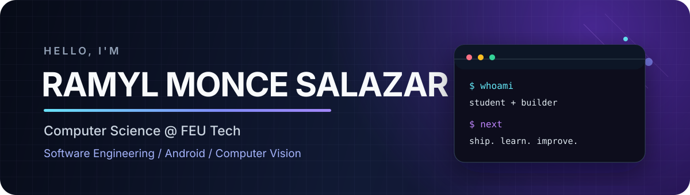

  

  
  
  

## About

I'm a fourth-year Computer Science student at **FEU Institute of Technology** who enjoys turning ideas into working software - from Android interfaces to Python-powered computer vision systems.

I care about building practical products, understanding how their pieces connect, and improving them through testing, feedback, and iteration. I'm currently looking for an internship or entry-level software engineering opportunity where I can contribute and keep growing with a strong team.

<table>
  <tr>
    <td width="50%" valign="top">
      <h3>What I build</h3>
      
Mobile experiences, backend integrations, and computer vision prototypes that solve concrete problems.

    </td>
    <td width="50%" valign="top">
      <h3>What I bring</h3>
      
Curiosity, steady execution, project management fundamentals, and a willingness to learn across the stack.

    </td>
  </tr>
</table>

## Selected Work

<table>
  <tr>
    <td width="33%" valign="top">
      <h3><a href="https://github.com/Ramyl-Salazar/Arithmos-APo-App">APo Android App</a></h3>
      
A Kotlin-based Android frontend designed as the user-facing side of the Arithmos APo system.

      
<code>Kotlin</code> <code>Android</code> <code>Mobile UI</code>

    </td>
    <td width="33%" valign="top">
      <h3><a href="https://github.com/Ramyl-Salazar/Arithmos-APo-App-Backend">APo Backend</a></h3>
      
Backend services and integrations that support the APo application's core workflows.

      
<code>Backend</code> <code>APIs</code> <code>Integration</code>

    </td>
    <td width="33%" valign="top">
      <h3><a href="https://github.com/Ramyl-Salazar/kiro-ph-computer-vision">Computer Vision</a></h3>
      
A collaborative Python computer vision project focused on experimentation and applied image processing.

      
<code>Python</code> <code>Computer Vision</code> <code>Collaboration</code>

    </td>
  </tr>
</table>

## Toolkit

  

| Focus | Technologies |
| --- | --- |
| Languages | Python, Kotlin, C++, TypeScript |
| Development | Android, backend services, API integration |
| Interests | Computer vision, mobile engineering, practical AI |
| Workflow | Git, GitHub, iterative development, project planning |

## Verified Credentials

| Credential | Issuer | Awarded |
| --- | --- | --- |
| **PMI Project Management Ready** | Project Management Institute | March 2026 |
| **Information Technology Specialist - Python** | Certiport / Pearson | July 2025 |
| **Microsoft Office Specialist: Excel 2019 Associate** | Microsoft | March 2023 |

---

  <strong>Interested in building useful software together?</strong> 
  <a href="https://www.linkedin.com/in/ramyl-monce-salazar-912123271">Connect with me on LinkedIn</a>

